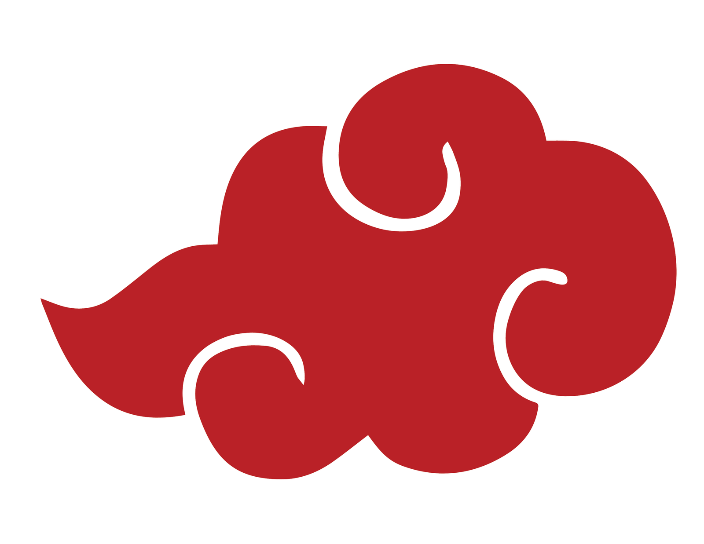

# Akatsuki's Shop - README

[]()
[]()



## Nomes dos Integrantes
- André Diogo Melchior da Silva
- Juan Pablo Firmino Ferreira
- Michael Akira de Lima Kuwahara
- Murilo de Oliveira Sartori
- Nickolas Lopes Araújo

## 📝 Descrição do Projeto

**Akatsuki's Shop** é um e-commerce temático baseado na organização Akatsuki do anime Naruto. O site oferece diversos produtos inspirados nos personagens, incluindo acessórios, roupas e itens de colecionador.

## 💻 Tecnologias Utilizadas

[]()
[]()
[]()

- **HTML5** - Estrutura do site
- **Bootstrap 5** - Framework para design responsivo
- **Font Awesome 6** - Ícones
- **Google Fonts** - Fonte Knewave


## ✨ Funcionalidades

### 🔍 Navegação
- Barra de navegação responsiva
- Links para Home, Sobre Nós e Login
- Ícone de carrinho

### 🚀 Como Executar

Clone o repositório:
```bash
git clone https://github.com/FatecLP/Site-Naruto.git
```
Abra index.html no navegador

### 📚 Dependências

Adicionadas via CDN:
```html
<!-- Bootstrap -->
<link href="https://cdn.jsdelivr.net/npm/bootstrap@5.3.0/dist/css/bootstrap.min.css" rel="stylesheet">
<script src="https://cdn.jsdelivr.net/npm/bootstrap@5.3.0/dist/js/bootstrap.bundle.min.js"></script>

<!-- Font Awesome -->
<link rel="stylesheet" href="https://cdnjs.cloudflare.com/ajax/libs/font-awesome/6.7.2/css/all.min.css">
```

### 📜 Licença

[](https://opensource.org/licenses/MIT)

Este projeto está licenciado sob a licença MIT - veja o arquivo [LICENSE](LICENSE.txt) para detalhes.

**Nota:** Projeto educacional. Personagens pertencem a seus criadores.
